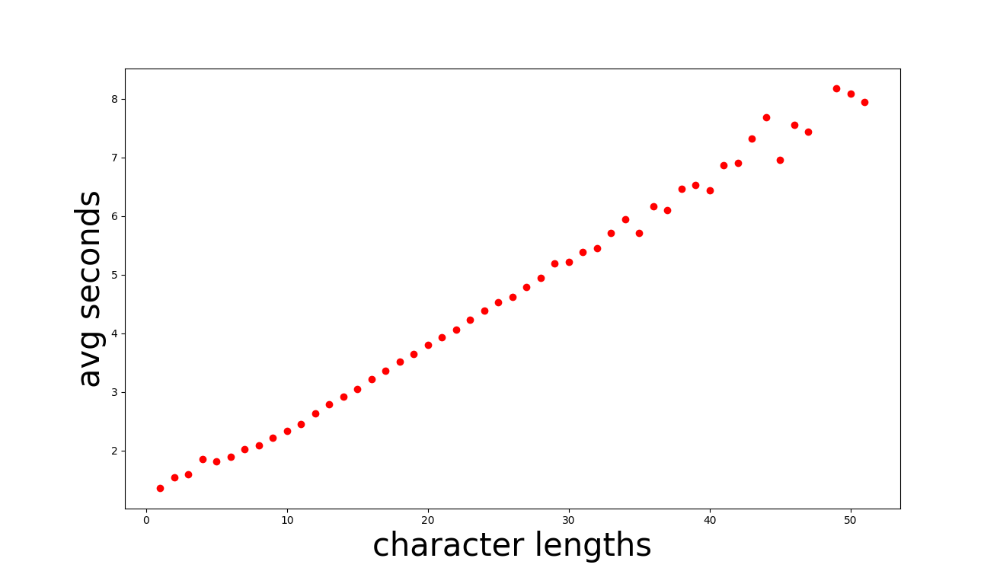
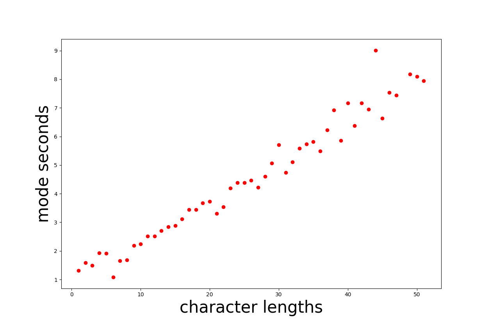
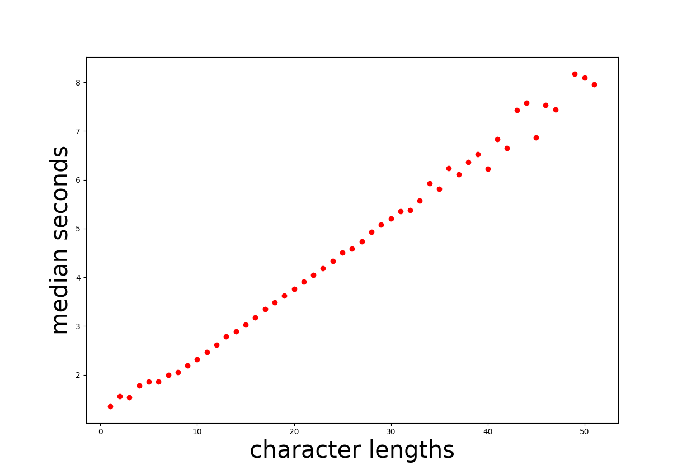
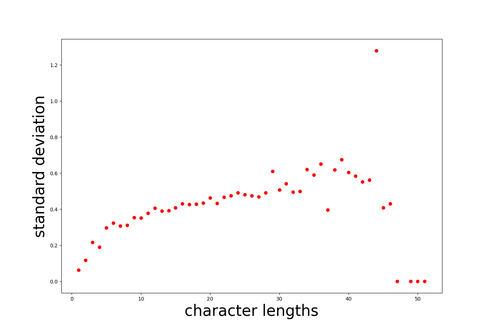
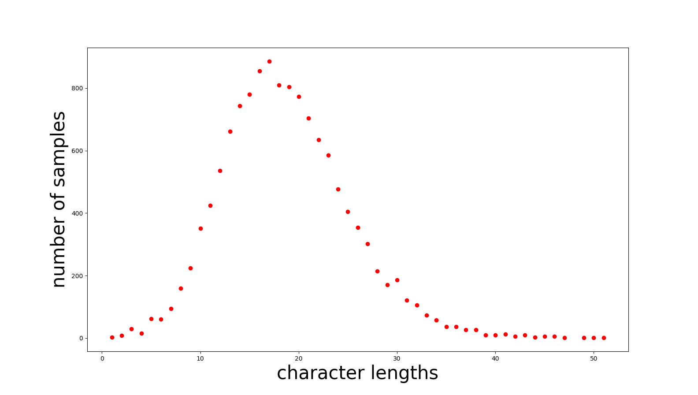
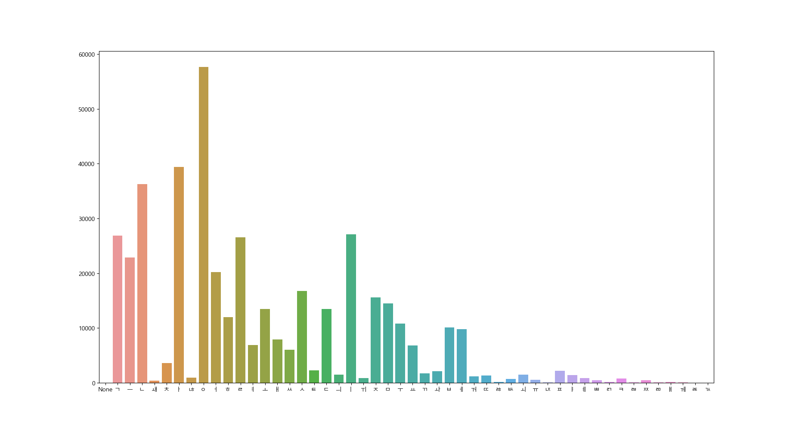
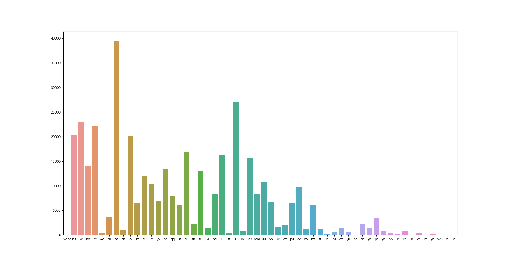

##
this repository is fork of [mimic2](https://github.com/MycroftAI/mimic2)
# modifyed cods
[ljspeech.py](https://github.com/jang-chinseok/Visualizing-voice-data/blob/main/datasets/ljspeech.py) 텍스트 데이터셋에서 자모분해 된 데이터를 텍스트로 넣도록 변형한 파일 (txt로 주어진 데이터의 인덱스 기준 3번.) 
[ljspeech1.py](https://github.com/jang-chinseok/Visualizing-voice-data/blob/main/datasets/ljspeech1.py) 받은 데이터 셋의 입출력에 맞도록 경로 등의 부분을 변형된 기본 사용 파일  
[analyze.py](https://github.com/jang-chinseok/Visualizing-voice-data/blob/main/analyze.py)새로운 시도를 위한 수정.() 
[analyze1.py](https://github.com/jang-chinseok/Visualizing-voice-data/blob/main/analyze1.py) 6번째 그래프를 그린 파일. 
[analuze2.py](https://github.com/jang-chinseok/Visualizing-voice-data/blob/main/analyze2.py) 마지막 그래프를 그린 파일. 
꼭 필요한 변경사항에 대해서 preprocess보다 ljspeech에 들어있는 내용이 직관적이었고 중요했기에 이에 대해서만 수정을 가함.
이 외의 수정은 파일을 읽어들이는 encoding 에 대해서 일괄적으로 utp-8 을 적용한 정도.
## 1.

## 2.

## 3

## 4

## 5

## 6

초성과 종성의 구분 없이 사용된 자모의 분포를 나타내도록 작성되어진 그래프.
## 7

초성과 종성의 구분을 한 후에, 해당 음소를 발음기호와 매칭시켜 작성되어진 그래프.
symbol table은 [KoG2P](https://github.com/scarletcho/KoG2P) 를 참고하였음.<ar>

library i used or tested
   [jamo](https://github.com/JDongian/python-jamo)
   [korean_romanizer](https://github.com/osori/korean-romanizer)
   [matplotlib.font_manager]
   ["github.com/hangulize/hangulize"](https://github.com/hangulize/hangulize)
   [g2pK: g2p module for Korean](https://github.com/Kyubyong/g2pK)
  
